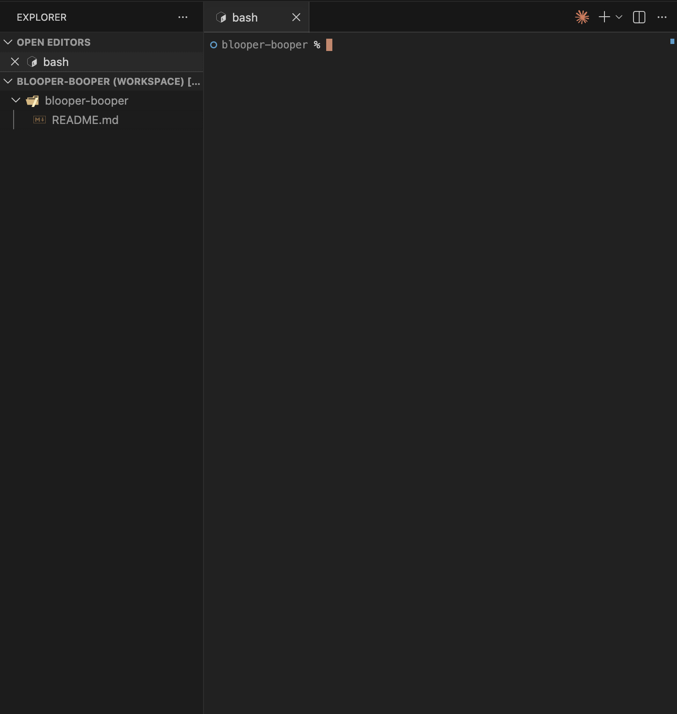
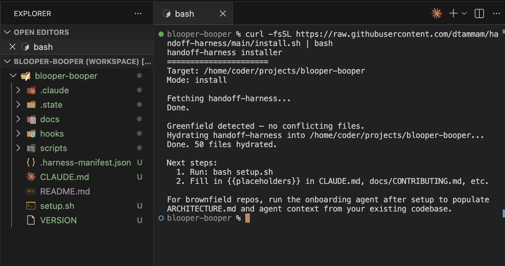
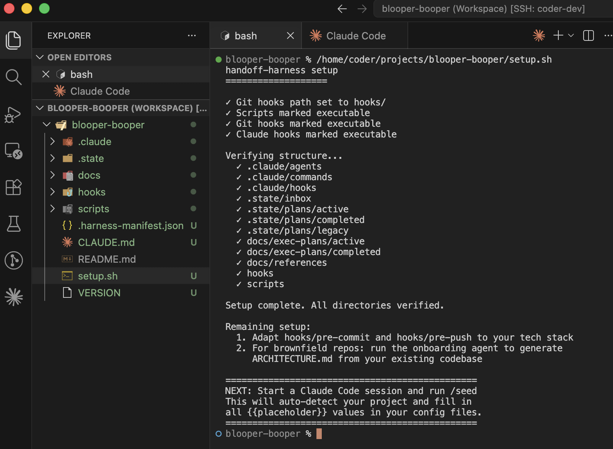
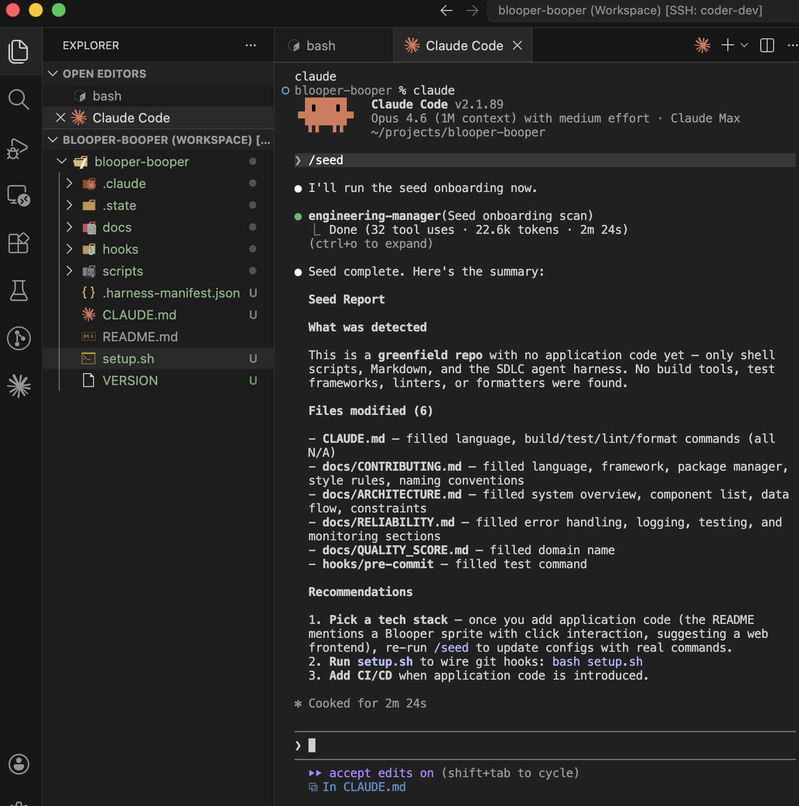
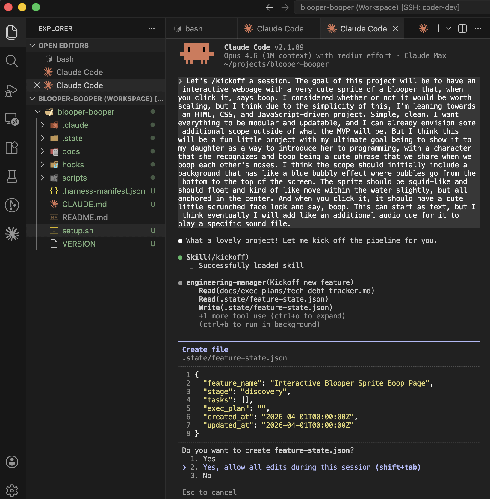
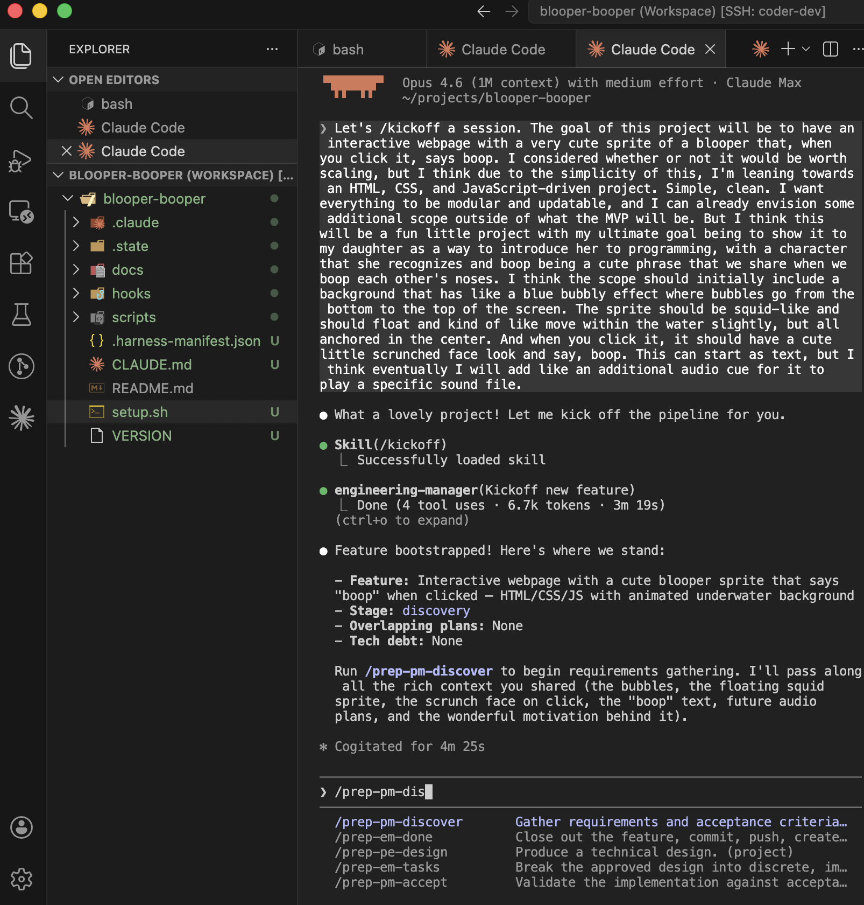
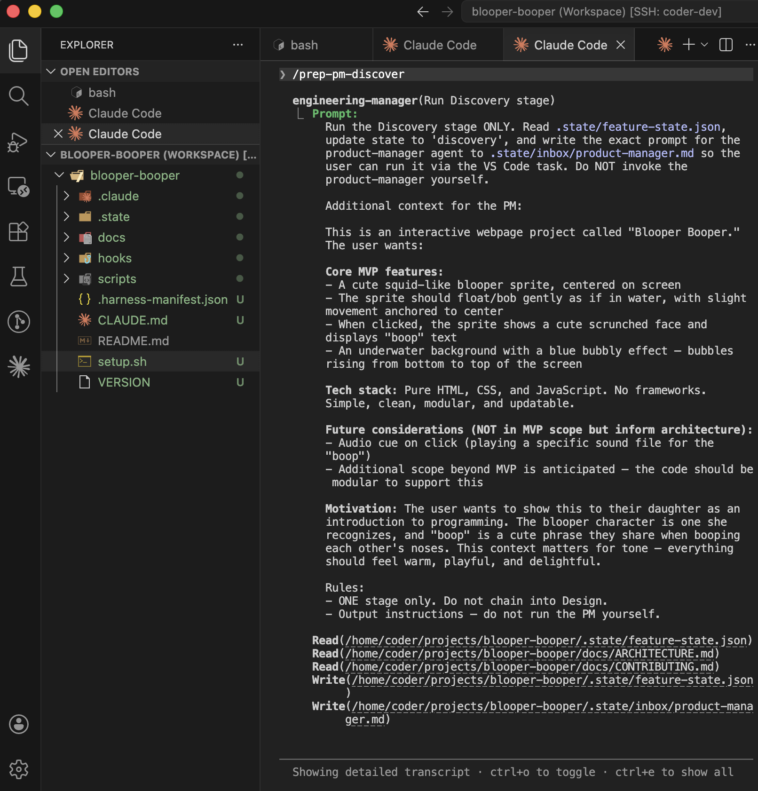
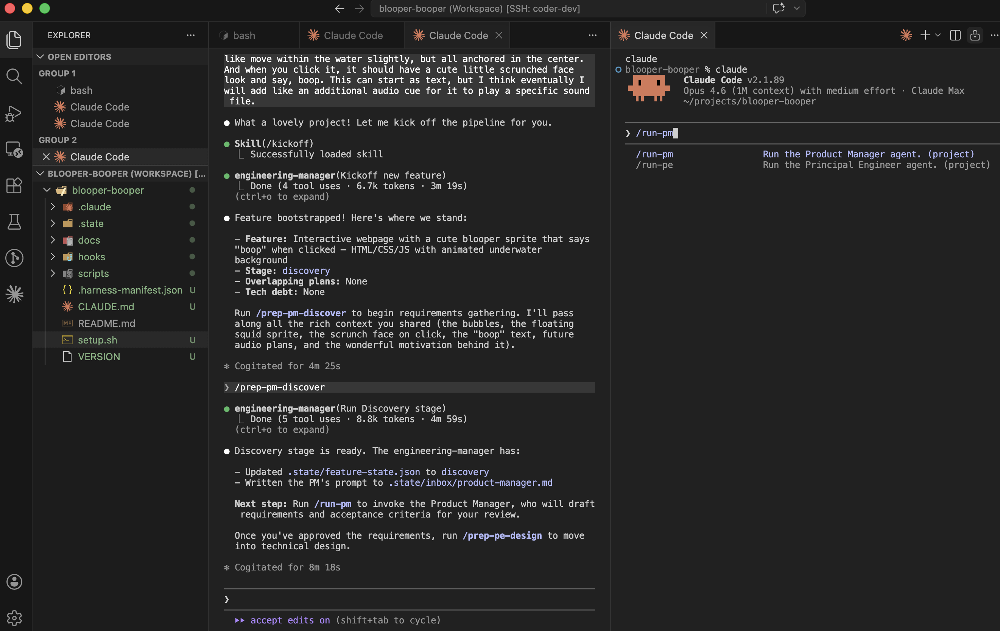
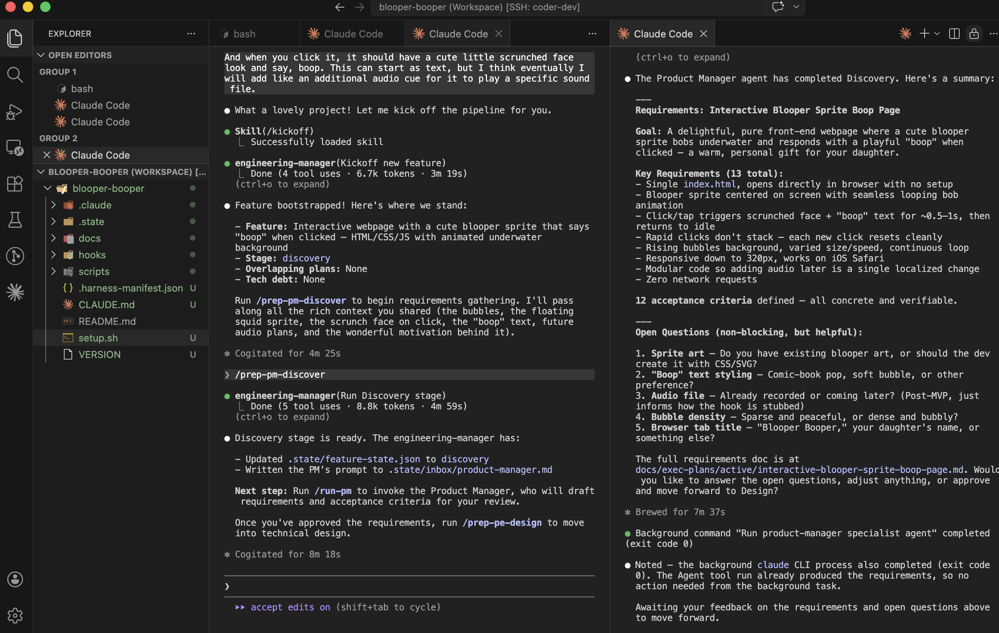

# handoff-harness

A multi-agent SDLC pipeline for Claude Code. Instead of one monolith session handling everything, specialist agents handle each phase of the development lifecycle in their own context window.

## Quick Start

```bash
# Install
curl -fsSL https://raw.githubusercontent.com/dtammam/handoff-harness/main/install.sh | bash

# Setup
bash setup.sh

# Seed (in Claude Code)
/seed

# Start building
/kickoff
```

## Architecture

```
User describes work
  → engineering-manager (orchestrator — never codes)
    → product-manager (Discovery: requirements & acceptance criteria)
    → principal-engineer (Design: technical approach)
    → engineering-manager (Task breakdown)
    → software-developer (Implementation: code & tests, per task)
    → build-specialist (Verify: build & test, per task)
    → product-manager (Acceptance: validate criteria)
  → Done
```

Every stage transition requires explicit user approval. No auto-progression.

## Agents

| Agent | File | Role | Model |
|-------|------|------|-------|
| engineering-manager | `.claude/agents/engineering-manager.md` | Orchestrator | opus |
| product-manager | `.claude/agents/product-manager.md` | Requirements & acceptance | sonnet |
| principal-engineer | `.claude/agents/principal-engineer.md` | Technical design | opus |
| software-developer | `.claude/agents/software-developer.md` | Implementation | sonnet |
| build-specialist | `.claude/agents/build-specialist.md` | Build & test runner | haiku |
| quality-assurance | `.claude/agents/quality-assurance.md` | Code review (optional) | sonnet |

## Coordination

Agents don't share a context window. They coordinate through:

1. **`.state/feature-state.json`** — lifecycle state, current stage, task list, artifact paths
2. **`docs/exec-plans/active/*.md`** — requirements, design, progress log
3. **`docs/CONTRIBUTING.md`** — shared coding standards all agents read

The engineering-manager reads and writes the state file. Other agents read it for context and write to exec plan files.

## Commands

Commands are organized into four groups: intake, commit, specialist invocation, and pipeline prep/utility.

| Command | File | Purpose |
|---------|------|---------|
| `/kickoff` | `.claude/commands/kickoff.md` | Simple intake for single-domain changes |
| `/kickoff-complex` | `.claude/commands/kickoff-complex.md` | Plan-gated intake for multi-domain/risky changes |
| `/commit-only` | `.claude/commands/commit-only.md` | Stage and commit with quality gates |
| `/commit-and-push` | `.claude/commands/commit-and-push.md` | Stage, commit, push with quality gates |
| `/run-pm` | `.claude/commands/run-pm.md` | Invoke product-manager (mobile workflow) |
| `/run-pe` | `.claude/commands/run-pe.md` | Invoke principal-engineer (mobile workflow) |
| `/run-sde` | `.claude/commands/run-sde.md` | Invoke software-developer (mobile workflow) |
| `/run-build` | `.claude/commands/run-build.md` | Invoke build-specialist (mobile workflow) |
| `/run-qa` | `.claude/commands/run-qa.md` | Invoke quality-assurance (mobile workflow) |
| `/show-me` | `.claude/commands/show-me.md` | Read-only pipeline status report |
| `/seed` | `.claude/commands/seed.md` | One-shot project onboarding with phased execution, dry-run mode, and brownfield safety |
| `/prep-pm-discover` | `.claude/commands/prep-pm-discover.md` | Prep Discovery -- route to Product Manager |
| `/prep-pe-design` | `.claude/commands/prep-pe-design.md` | Prep Design -- route to Principal Engineer |
| `/prep-em-tasks` | `.claude/commands/prep-em-tasks.md` | Prep Tasks -- EM breaks design into tasks |
| `/prep-sde-implement` | `.claude/commands/prep-sde-implement.md` | Prep Implementation -- route to Software Developer |
| `/prep-build-verify` | `.claude/commands/prep-build-verify.md` | Prep Verification -- route to Build Specialist |
| `/prep-qa-review` | `.claude/commands/prep-qa-review.md` | Prep Review -- route to Quality Assurance |
| `/prep-pm-accept` | `.claude/commands/prep-pm-accept.md` | Prep Acceptance -- route to Product Manager |
| `/prep-em-done` | `.claude/commands/prep-em-done.md` | Close feature -- commit, push, PR, optional release |

## Walkthrough

### 1. A blank workspace

Start with a fresh project directory. All you need is a repo with a README.



*A blank project workspace before handoff-harness is installed.*

### 2. Run the one-liner installer

Run the curl installer to hydrate the repo with agents, commands, hooks, and state files.



*Running the one-liner installer to hydrate a greenfield repo.*

### 3. Run setup

Execute `setup.sh` to verify the directory structure and wire git hooks.



*Running `setup.sh` to wire git hooks and verify directory structure.*

### 4. Seed the project

Use the `/seed` command to auto-detect your tech stack and fill in configuration placeholders across all config files.



*Running `/seed` to auto-detect the tech stack and fill configuration placeholders.*

### 5. Kick off a feature

Use `/kickoff` to start a new feature. The engineering-manager creates the feature state and routes to the discovery stage.



*Using `/kickoff` to start a new feature -- the EM creates the feature state and routes to discovery.*

### 6. Prepare for discovery

After kickoff, the EM summarizes what happens next. Run `/prep-pm-discover` to prepare the product-manager's inbox for the Discovery stage.



*After kickoff, the EM summarizes next steps and prompts the user to run `/prep-pm-discover`.*

### 7. Run the prep command

Running `/prep-pm-discover` writes the product-manager's inbox file and advances the pipeline state.



*Running `/prep-pm-discover` to prepare the product-manager inbox for the Discovery stage.*

### 8. Invoke the specialist

Switch to the specialist session and run `/run-pm` to invoke the product-manager agent.



*In the specialist session, `/run-pm` invokes the product-manager agent to run Discovery.*

### 9. Discovery complete

The product-manager agent reads its inbox, runs Discovery, and presents requirements and acceptance criteria for user approval.



*The product-manager agent completes Discovery and presents requirements and acceptance criteria for user approval.*

## Installation

### New repo (greenfield)

```bash
curl -fsSL https://raw.githubusercontent.com/dtammam/handoff-harness/main/install.sh | bash
```

### Existing repo (brownfield)

Same command — the installer detects existing files and archives them to `.state/plans/legacy/`. Harness-owned files (agents, commands, hooks) are overwritten with the latest versions. Project-owned files (CLAUDE.md, CONTRIBUTING.md, ARCHITECTURE.md, RELIABILITY.md, QUALITY_SCORE.md, AGENTS.md) and scaffold files (tech-debt-tracker.md) are preserved — template versions are written as `.harness-update` sidecars for manual review.

After hydration, run `/seed` to auto-detect your tech stack and fill placeholders.

### Updating

```bash
curl -fsSL https://raw.githubusercontent.com/dtammam/handoff-harness/main/install.sh | bash -s -- --update
```

## Directory Structure

```
.claude/
  agents/              # Agent definitions (one .md per agent)
  commands/            # Slash commands for Claude Code
  hooks/               # Claude Code hooks (e.g., SessionStart)
  settings.json        # Claude Code settings (hooks registration)
.state/
  feature-state.json   # Current feature lifecycle state
  inbox/               # EM writes here, specialists read from here
  plans/
    active/            # In-flight execution plans
    completed/         # Finished plans
    legacy/            # Pre-hydration artifacts archived here
docs/
  ARCHITECTURE.md      # Generated during onboarding from codebase scan
  CONTRIBUTING.md      # Coding standards all agents read
  AGENTS.md            # Agent operating instructions
  RELIABILITY.md       # Reliability and quality standards
  QUALITY_SCORE.md     # Quality grading by domain
  exec-plans/
    active/            # Active execution plan files
    completed/         # Completed execution plan files
    tech-debt-tracker.md
  references/          # Reference docs for agents
hooks/
  pre-commit           # Git pre-commit hook
  pre-push             # Git pre-push hook
scripts/
  run-product-manager.sh
  run-principal-engineer.sh
  run-software-developer.sh
  run-build-specialist.sh
  run-quality-assurance.sh
CLAUDE.md              # Claude Code entry point
install.sh             # Hydration script
setup.sh               # Post-hydration setup (git hooks, permissions)
```

## Mobile Workflow (Happy Coder)

Two sessions running simultaneously against the same working directory:

- **Session 1 (EM):** Persistent, long-running. Uses `/kickoff` to start features, then `/prep-*` commands (e.g., `/prep-pm-discover`, `/prep-pe-design`, `/prep-sde-implement`) to advance through pipeline stages.
- **Session 2 (Specialist workbench):** Ephemeral, one agent at a time. Uses `/run-pm`, `/run-pe`, `/run-sde`, `/run-build`, or `/run-qa` to invoke the agent whose inbox was prepared by Session 1.

The EM writes `.state/inbox/<agent-name>.md`. Session 2 consumes those inbox files via the `/run-*` commands.

## License

MIT
